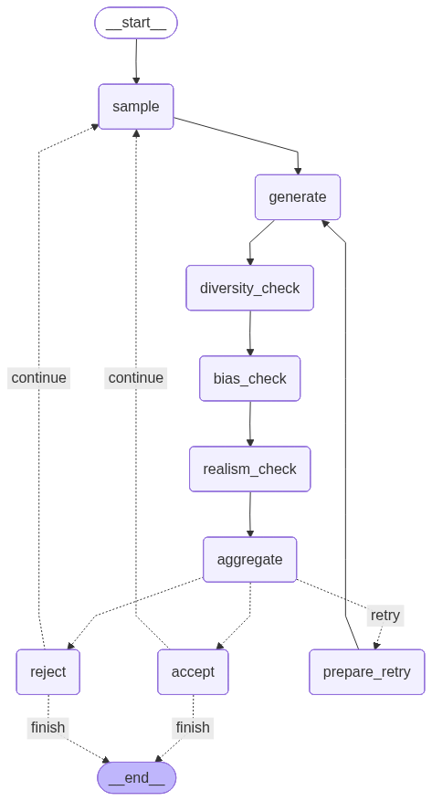

# Synthetic Review Data Generator with Quality Guardrails.

A LangGraph-based system for generating high-quality synthetic reviews with configurable personas, multi-model support, and comprehensive quality guardrails.

## Features

- **Multi-step Generation Pipeline**: Uses LangGraph to orchestrate review generation with quality validation
- **Quality Guardrails**: Diversity, bias detection, and domain realism validation
- **Multi-Model Support**: OpenAI and Groq integration
- **Configurable Personas**: Define custom personas with specific tones and expectations
- **Real vs Synthetic Comparison**: Compare generated reviews against real review datasets
- **Comprehensive Reporting**: Generate detailed quality reports with metrics

## Workflow

The review generation pipeline uses LangGraph to orchestrate a multi-step process with quality validation at each stage.



*LangGraph workflow visualization showing the review generation pipeline*

### Pipeline Flow

1. **Entry Point - Sampling**: The process starts with the `sample` node, which randomly selects a persona (e.g., "Startup Founder", "Enterprise PM") and a rating (1-5 stars) based on the configured distribution.

2. **Generation Phase**: The `generate` node creates review text using the selected LLM model (OpenAI or Groq), incorporating the persona's tone, expectations, and the target rating.

3. **Quality Checks - Sequential Guardrails**: Each generated review passes through three quality guardrails in sequence:
   - **Diversity Check**: Ensures the review is sufficiently different from previously accepted reviews
   - **Bias Check**: Validates that sentiment aligns with the rating and the review fits the expected distribution
   - **Realism Check**: Uses LLM-as-judge to evaluate if the review sounds realistic and domain-appropriate

4. **Aggregation**: The `aggregate` node combines all guardrail results and determines if the review passes all quality checks.

5. **Routing Logic**: Based on aggregation results:
   - **Accept**: If all guardrails pass → review is accepted → check if target size reached → continue sampling or finish
   - **Retry**: If any guardrail fails but retries remain → `prepare_retry` → increment retry count → loop back to `generate` with feedback
   - **Reject**: If max retries (default: 2) reached → review is rejected → check if target size reached → continue sampling or finish

6. **Loop Control**: The process continues until:
   - Target number of accepted reviews is reached, OR
   - Safety limit is hit (10x target attempts) to prevent infinite loops when acceptance rate is too low

## Quality Guardrails

All three guardrails must pass for a review to be accepted. Each guardrail is configurable via YAML configuration files.

### Diversity Guardrail

**Purpose**: Ensures reviews are diverse and not too similar to previously accepted reviews.

**Metrics**:
- **Vocabulary Overlap** (Jaccard similarity) < 0.3: Measures word-level similarity
- **Semantic Similarity** (cosine similarity) < 0.85: Measures meaning-level similarity using embeddings

**How it works**: 
- Compares the current review against all previously accepted reviews
- Uses sentence-transformers for semantic embeddings
- Calculates average vocabulary overlap and maximum semantic similarity
- First review always passes (no comparison baseline)

**Configuration**:
```yaml
guardrails:
  diversity:
    vocab_overlap_threshold: 0.3
    semantic_similarity_threshold: 0.85
```

### Bias Guardrail

**Purpose**: Ensures sentiment matches rating and the review distribution is statistically reasonable.

**Metrics**:
- **Sentiment-Rating Alignment**: Positive ratings (4-5) should have positive sentiment (compound > 0.1), negative ratings (1-2) should have negative sentiment (compound < -0.1), neutral ratings (3) should be close to neutral (|compound| < 0.3)
- **Z-Score** < 2.0: Sentiment should not be too far from the distribution of accepted reviews

**How it works**:
- Uses VADER sentiment analysis to compute compound sentiment scores
- Validates alignment between rating and sentiment polarity
- Calculates z-score against the mean and standard deviation of accepted reviews' sentiment scores
- Prevents reviews that are statistical outliers in sentiment distribution

**Configuration**:
```yaml
guardrails:
  bias:
    z_score_threshold: 2.0
```

### Realism Guardrail

**Purpose**: Ensures reviews sound realistic, domain-appropriate, and avoid hallucinations.

**Metrics**: 
- **Realism Score** >= 0.7: LLM-as-judge evaluates the review on a 0.0-1.0 scale

**How it works**:
- Uses an LLM (prefers Groq models, falls back to OpenAI) to evaluate the review
- Checks for:
  - Realistic domain concepts and features
  - Absence of obviously fake or hallucinated details
  - Tone matching the expected persona tone
  - Genuine user review characteristics
- Falls back to heuristic-based scoring if LLM validation fails (checks length, domain keywords, balanced language)

**Configuration**:
```yaml
guardrails:
  realism:
    realism_score_threshold: 0.7
```

### Aggregation Logic

- **All three guardrails must pass** for a review to be accepted
- Detailed rejection reasons are provided when any guardrail fails (e.g., "Diversity FAILED: vocab_overlap=0.45, semantic_sim=0.92")
- Retry mechanism: up to `max_retries` (default: 2) attempts before final rejection
- Each retry includes feedback about why the previous attempt failed

## Tradeoffs and Design Decisions

### Quality vs. Efficiency

- **Stricter thresholds** = Higher quality reviews but more rejections and retries, leading to longer generation times
- **Retry mechanism** balances quality assurance with generation efficiency by giving failed reviews a second chance
- **Safety limit** (10x target attempts) prevents infinite loops when acceptance rate is too low, ensuring the process terminates

### Cost vs. Quality

- **LLM validation** (realism guardrail) adds API costs but significantly improves quality by catching unrealistic reviews
- **Embedding-based diversity checks** require sentence-transformers model loading but provide accurate semantic similarity detection
- **Multi-model support** allows cost optimization by using cheaper models (e.g., Groq) for generation while maintaining quality standards

### Scalability Considerations

- **Diversity checks** become more computationally expensive as accepted reviews grow (O(n) comparisons per new review)
- **Semantic similarity** uses batch processing for efficiency when comparing against multiple reviews
- **State management** tracks all accepted reviews in memory - consider database storage for very large datasets (>10k reviews)

### Configurability

- All thresholds are configurable via YAML config files, allowing tuning for different domains and quality requirements
- Default thresholds balance quality and acceptance rate for general use cases
- Domain-specific tuning may be needed (e.g., technical products may need stricter realism thresholds)

## Installation

```bash
pip install -r requirements.txt
```

## Environment Variables

Create a `.env` file in the project root (or export these in your shell):

```bash
# Required if using OpenAI models (e.g., gpt-4o-mini)
# Get your API key from: https://platform.openai.com/api-keys
OPENAI_API_KEY=your_openai_api_key_here

# Required if using Groq models (e.g., llama-3.3-70b-versatile)
# Get your API key from: https://console.groq.com/keys
GROQ_API_KEY=your_groq_api_key_here

# Optional: LangSmith tracing for observability
# Get your API key from: https://smith.langchain.com
# Enable tracing to monitor LLM calls and LangGraph execution
LANGCHAIN_TRACING_V2=true
LANGCHAIN_API_KEY=your_langsmith_api_key_here
LANGCHAIN_PROJECT=review-generation  # Optional: project name for organizing traces
```

**Note**: 
- `OPENAI_API_KEY` is **required** if your configuration uses OpenAI models
- `GROQ_API_KEY` is **required** if your configuration uses Groq models
- Set the appropriate API key(s) based on which provider(s) you use in your config
- `LANGCHAIN_TRACING_V2` and `LANGCHAIN_API_KEY` are **optional** - enable these to trace all LLM calls and LangGraph execution in LangSmith. If not set, tracing will be silently skipped.

## Usage

### Generate Reviews

```bash
python -m cli.main generate --config configs/examples/saas_pm_tool.yaml --target-size 300 --output-dir ./output
```

### Compare with Real Reviews

```bash
python -m cli.main compare --synthetic ./output/reviews.json --real ./data/real_reviews.json
```

### Generate Report

```bash
python -m cli.main report --metrics ./output/metrics.json --output ./output/report.md
```

## Configuration

See `configs/examples/saas_pm_tool.yaml` for an example configuration file.

## Project Structure

- `src/`: Core implementation
  - `graph/`: LangGraph pipeline definition
  - `nodes/`: Individual pipeline nodes (generation, guardrails, routing)
  - `guardrails/`: Quality guardrail implementations
  - `metrics/`: Evaluation and reporting
  - `models/`: LLM provider abstractions
- `configs/`: Configuration files
- `cli/`: Command-line interface
- `tests/`: Test suite
- `visualize_graph.py`: Graph visualization utility (generates Mermaid diagram)
- `GUARDRAILS_EXPLAINED.md`: Detailed guardrail documentation and troubleshooting

